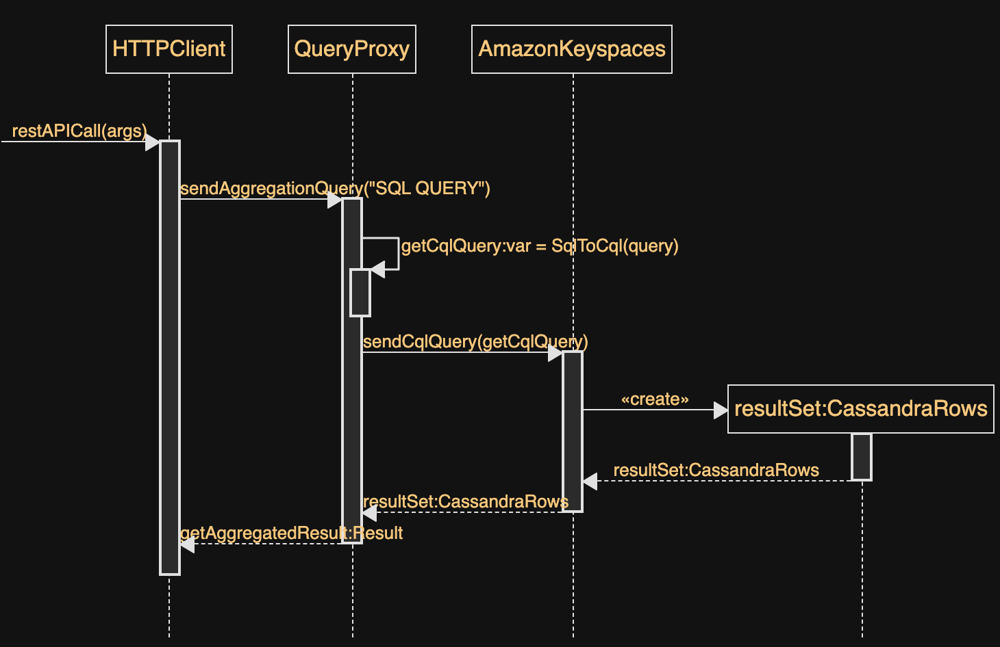

# Aggregation-query-proxy

There are use-cases when you need to aggregate bounded result sets for a short time period from DynamoDB or Keyspaces, for example, 
an hourly or daily report, including all hourly or daily sales. However, Amazon DynamoDB and Keyspaces do not support 
the commonly seen SQL aggregation constructs such as COUNT, SUM, MIN, MAX, and GROUP BY, as aggregation queries with unbound number of 
partitions might take unpredictable time to execute. Because of this constraint, it is better to preprocess the operational data to 
do the aggregation, and storage of the processed data in Amazon DynamoDB/Keyspaces. 
This pattern provides a solution by placing a scalable aggregation proxy (sidecar) between your application and DynamoDB/Keyspaces.

The aggregation-query-proxy (AQP) consists of a scalable proxy layer that sits between your application 
and Amazon Keyspaces/DynamoDB.

It provides intermediate aggregation logic which allows existing application to execute 
aggregation queries against Amazon DynamoDB/Keyspaces.

The AQP converts the provided aggregation query (SQL-92) to a plain request (CQL/DDBPartiQL).
After the plain response (json) has been received the AQP uses IonEngine to aggregate the plain response into 
the final result set in json format.
 


Create your yaml based on the template:

`cp conf/keyspaces-aggregation-query-proxy.yaml.template conf/keyspaces-aggregation-query-proxy.yaml`

### Configure and build the app with Amazon Keyspaces
Set ```dataBaseName``` to ```KEYSPACES```
Set ```pathToKeyspacesConfigFile``` to ```/usr/app```

#### Configure DataStax conf file
Prepare DataStax java driver conf file

### Build the project
`mvn install`
`build.sh <AWS_ACCOUNT> <REGION>`

### Start a docker container with the app 
```docker run -it -p 8080:8080 simple-aggregation-query-app```

### Limitations
As a best practice we recommend executing bounded Amazon Keyspaces (CQL) or DynamoDB (PartiQL) 
requests against the Aggregation Query Proxy. In all cases, avoid unbounded aggregations 
queries (without WHERE clause). Unbounded aggregation queries might lead to unpredictable execution time, 
high JVM memory pressure on AQP nodes (OOM), or high Amazon DynamoDB/Keyspaces RCUs consumption.

## Configure and build the app with Amazon DynamoDB
Set ```dataBaseName``` to ```DYNAMODB```
Set ```dynamoRegion``` to  ```us-east-1```
### Build the project
`mvn install`
`build.sh <AWS_ACCOUNT> <REGION>`

### Start a docker container with the app
```docker run -it -p 8080:8080 --env AWS_REGION="us-east-1" --env AWS_ACCESS_KEY_ID=$AWS_ACCESS_KEY_ID --env AWS_SECRET_ACCESS_KEY=$AWS_SECRET_ACCESS_KEY --env AWS_SESSION_TOKEN=$AWS_SESSION_TOKEN simple-aggregation-query-app```

### Let's execute a query

`AUTH_BASIC=$(echo -n large-query-app:your_secret | base64)`

`http --follow --timeout 3600 GET 'http://0.0.0.0:8080/query-aggregation/select count(book_title) as books, award, avg(rank) as avg_rang from keyspaces_sample.keyspaces_sample_table GROUP BY award'  Authorization:'Basic '$(AUTH_BASIC)`

`HTTP/1.1 200 OK`
`Cache-Control: no-transform, max-age=60`
`Content-Encoding: gzip`
`Content-Length: 195`
`Content-Type: application/json`
`Date: Wed, 04 May 2022 01:59:16 GMT`
`Vary: Accept-Encoding`

```json
{
    "response": [{"resultSet":[{"books":3,"award":"Kwesi Manu Prize","avg_rang":2e0},
                                 {"books":3,"award":"Richard Roe","avg_rang":2e0},
                                 {"books":3,"award":"Wolf","avg_rang":2e0}]}],
    "stats": {
        "elapsedTimeToAggregateDataInMs": 361,
        "elapsedTimeToRetrieveDataInMs": 120,
        "payloadSizeBytes": 626
    }
}
```

### Local DynamoDB for JUnit test
Set ```localDDB``` to  ```true``` to run all JUnit tests against DynamoDB

## License
This project is licensed under the MIT-0