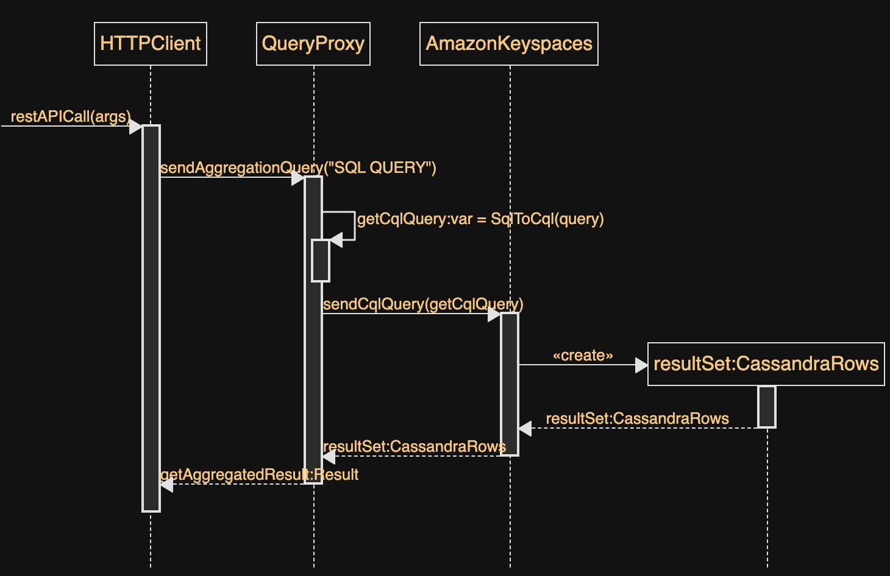

# Aggregation-query-proxy

There are use-cases when you need to aggregate bounded result sets for a short time period from DynamoDB or Keyspaces, for example, 
an hourly or daily report, including all hourly or daily sales. However, Amazon DynamoDB and Keyspaces do not support 
the commonly seen SQL aggregation constructs such as COUNT, SUM, MIN, MAX, and GROUP BY, as aggregation queries with unbound number of 
partitions might take unpredictable time to execute. Because of this constraint, it is better to preprocess the operational data to 
do the aggregation, and storage of the processed data in Amazon DynamoDB/Keyspaces. 
This pattern provides a solution by placing a scalable aggregation proxy (sidecar) between your application and DynamoDB/Keyspaces.

The aggregation-query-proxy (AQP) consists of a scalable proxy layer that sits between your application 
and Amazon Keyspaces/DynamoDB.

It provides intermediate aggregation logic which allows existing application to execute 
aggregation queries against Amazon DynamoDB/Keyspaces.

The AQP splits each aggregation query in two: a plain projection pushed down to the data
store (CQL for Keyspaces, PartiQL for DynamoDB), and the aggregation itself, evaluated over the
returned rows by the [PartiQL](https://partiql.org/) engine inside the proxy. See
"How a query is split" below.
 


### Requirements
Java 21 and Maven 3.6.3+ to build locally, or only Docker to build the image.

### Configuration
There is one configuration file, `query-app/conf/keyspaces-aggregation-query-proxy.yaml`. It
contains no secrets: values written as `${NAME}` are read from environment variables at
startup, and the application refuses to start if a referenced variable is not set.

| Variable | Default | Meaning |
|---|---|---|
| `AQP_SERVICE_NAME` | `KEYSPACES` | `KEYSPACES` or `DYNAMODB` |
| `AWS_REGION` | `us-east-1` | Region of the Keyspaces or DynamoDB endpoint |
| `AQP_KEYSPACES_CONFIG_DIR` | `/usr/app` | Directory containing `KeyspacesConnector.conf` |
| `AQP_AGGREGATION_ENGINE` | `PARTIQL` | Aggregation engine: `PARTIQL` or `DUCKDB` (see "Aggregation engines") |
| `AQP_REPORTING_APP_SECRET` | *(required)* | Secret of the `reporting-app` API client |

#### API clients
Each client has its own secret (at least 16 characters) and roles. Add one entry per client
under `users`, each reading its secret from its own variable:

```yaml
users:
  reporting-app:
    secret: ${AQP_REPORTING_APP_SECRET}
    roles: [SMALL_QUERY]
  batch-app:
    secret: ${AQP_BATCH_APP_SECRET}
    roles: [LARGE_QUERY]
```

Roles are reserved for future per-role query budgets and are not yet enforced: every
configured client may run any accepted query.

In production, supply the variables from AWS Secrets Manager (for example through ECS task
definition `secrets`) rather than plain environment configuration. The former single
`clientSecret` setting is no longer supported, and startup fails if it is present.

#### Amazon Keyspaces
`KeyspacesConnector.conf` authenticates with SigV4 using the AWS default credential chain, so
it holds no credentials. Grant the task or instance role read-only access, for example
`cassandra:Select` on the keyspace and table. TLS hostname validation is on; Keyspaces
certificates validate against the JDK's default trust store.

#### Amazon DynamoDB
Credentials come from the AWS default credential chain. Grant read-only access:
`dynamodb:PartiQLSelect` on the table (and on its indexes if you query them), and
`dynamodb:ListTables` for the startup health check. Optionally grant `dynamodb:DescribeTable`
too: it lets `COUNT(*)`-style queries fetch only the key; without it they still work but fetch
whole items.

### Build
```
mvn install                                 # build and test locally
docker build -f build-script/Dockerfile -t simple-aggregation-query-app .
build-script/build.sh <AWS_ACCOUNT> <REGION> # build and push to ECR, tagged :<git sha> and :latest
```

The image builds the jar itself (multi-stage), runs as an unprivileged user, sizes its heap from
the container memory limit, and has a `HEALTHCHECK`.

### Run
```
docker run -p 8080:8080 \
  --env AQP_SERVICE_NAME=DYNAMODB --env AWS_REGION=us-east-1 \
  --env AQP_REPORTING_APP_SECRET \
  simple-aggregation-query-app
```

On AWS compute, credentials come from the task or instance role. Locally, pass them the usual
way (`--env AWS_ACCESS_KEY_ID ...` or a mounted `~/.aws`).

The admin port (8081: health checks, metrics, thread dumps, log-level tasks) has no
authentication and listens on 127.0.0.1 only. Do not publish it.

### Deploy on ECS Fargate
A security-first runbook — TLS at the ALB, least-privilege task IAM, private subnets with VPC
endpoints, read-only root filesystem, secrets injected from Secrets Manager — is in
[`docs/ecs-fargate.md`](docs/ecs-fargate.md), with a hardened task-definition template in
[`deploy/ecs/task-definition.json`](deploy/ecs/task-definition.json). The unauthenticated
`GET /ping` endpoint exists for the load balancer's target health checks.

### Querying
Send the query in a `POST` body:

```
curl -u reporting-app:$AQP_REPORTING_APP_SECRET -H 'Content-Type: application/json' \
  -d '{"query": "SELECT award, COUNT(book_title) AS books, AVG(rank) AS avg_rank FROM keyspaces_sample.keyspaces_sample_table GROUP BY award"}' \
  http://localhost:8080/query-aggregation
```

`GET` is also supported, in two forms:

* `GET /query-aggregation?query=<url-encoded query>`
* `GET /query-aggregation/<url-encoded query>`. This form cannot contain a `/` (division,
  dates, ARNs, URLs in literals): an encoded `%2F` in a path is an ambiguous path separator,
  which the web server rejects with `400` before the request reaches the proxy. Use the
  `?query=` form or `POST` for such queries.

Both put the query, including literal values in the `WHERE` clause (often customer
identifiers), into access logs, proxy logs and browser history. Prefer `POST`.

### Limitations
As a best practice we recommend executing bounded Amazon Keyspaces (CQL) or DynamoDB (PartiQL) 
requests against the Aggregation Query Proxy. In all cases, avoid unbounded aggregations 
queries (without WHERE clause). Unbounded aggregation queries might lead to unpredictable execution time, 
high JVM memory pressure on AQP nodes (OOM), or high Amazon DynamoDB/Keyspaces RCUs consumption.

Aggregation happens in the heap of a single AQP node, so the result set is capped. A query that
exceeds either cap is rejected with `413 Request Entity Too Large` rather than being answered
from partial data:

| Setting | Default | Meaning |
|---|---|---|
| `maxRows` | `100000` | Maximum rows read from the data store for one query |
| `maxResultBytes` | `67108864` (64 MiB) | Maximum size of the push-down result set |

### How a query is split
The proxy splits each query in two:

* **Push-down**, sent to the data store: `SELECT <columns> FROM <table> [WHERE ...]`. The
  `FROM` and `WHERE` text is passed through verbatim, so dialect-specific predicates such as
  `begins_with(...)`, `token(...)`, CQL's `PER PARTITION LIMIT` and `ALLOW FILTERING` work.
  `<columns>` is every column referenced anywhere in the aggregation clauses — including
  `GROUP BY` keys that are not in the `SELECT` list.
* **Aggregation**, run over those rows by the selected engine (see "Aggregation engines";
  PartiQL by default): the `SELECT` list, `GROUP BY`, `HAVING` and `ORDER BY`. `OFFSET` and
  `LIMIT` are then applied to the result rows by the proxy.

`LIMIT` caps the result rows (for example the number of groups), so an aggregate still reads
every matching row: `SELECT COUNT(*) ... LIMIT 1` counts all of them. The exception is a plain
projection (no aggregate, `GROUP BY`, `HAVING`, `ORDER BY`, `DISTINCT` or `OFFSET`), where the
first N rows are the answer: there the `LIMIT` is applied while reading, and only N rows are
read. `LIMIT` and `OFFSET` must be integer literals. To bound what an aggregate reads, narrow
the `WHERE` clause; `maxRows` is the backstop.

A query that references no column, such as `SELECT COUNT(*) ...`, reads only the table's key
rather than whole rows.

Not supported, each rejected with `400` and a message saying why: joins, table aliases,
subqueries, set operations (`UNION` etc.), comments (`--`, `/* */` and CQL `//`).

### Aggregation engines
The aggregation half of each query runs on a selectable engine; the push-down, API, budgets and
response envelope are identical either way. Both engines pass the same contract and parity test
suites: for the supported query shapes they return the same rows, with numbers exact to all 38
DynamoDB digits, and both tolerate rows that lack a referenced attribute (schemaless items).

| | `PARTIQL` (default) | `DUCKDB` |
|---|---|---|
| What it is | PartiQL, evaluated in-process on the JVM | DuckDB, an embedded columnar SQL engine, via JDBC |
| Footprint | none beyond the proxy | ~81 MB of native libraries in the jar; a native crash can take the whole process down |
| Memory | JVM heap, bounded by `maxRows`/`maxResultBytes` | its own ceiling, derived from `maxResultBytes`; exceeding it is a clean `413` |
| When to choose | the safe default | aggregation-heavy workloads where columnar execution pays |

Behaviour differences (each pinned by a test; everything not listed is identical):

* A projected attribute missing from a row appears as `"x": null` on DuckDB; PartiQL omits the
  field. Aggregates are unaffected — both skip the row.
* `/` is SQL float division on DuckDB (`7/2 = 3.5`); PartiQL keeps integer semantics (`3`).
* An unaliased aggregate is named `count(pk)` on DuckDB, `_1` on PartiQL. Alias your aggregates.
* DuckDB identifiers are case-insensitive: rows carrying two attributes that differ only in
  letter case (`amount` and `Amount`) are rejected with a `400`. PartiQL loads them.
* An attribute whose values span more than 38 total digits across rows (for example `1E30` and
  `1E-30` together) degrades to floating point on DuckDB, with a warning logged.

When running the container with `DUCKDB`, remember DuckDB's memory is native, outside the JVM
heap: on small containers lower `-XX:MaxRAMPercentage` so heap plus engine fit the limit.

### Accepted statements
The proxy is read-only. Only a single `SELECT` statement is accepted; anything else — including
`INSERT`, `UPDATE`, `DELETE`, `DROP`, or a second statement appended after a `;` — is rejected
with `400 Bad Request` before it reaches the data store. Grant the proxy read-only credentials
as well (for example `dynamodb:PartiQLSelect` without the write actions).

### Error responses
| Status | Cause |
|---|---|
| `400` | Statement is not a single read-only SELECT, uses an unsupported shape, could not be evaluated by the aggregation step, or was rejected by the data store |
| `401` | Missing or invalid credentials |
| `404` | Table does not exist |
| `422` | POST body is missing the `query` field, or it is blank or oversized |
| `413` | Result set exceeded `maxRows` or `maxResultBytes`, or (DuckDB engine) the aggregation exceeded the engine memory ceiling |
| `429` | Table or account throughput exceeded; retry with exponential back-off |
| `502` | The data store could not serve the query, including the proxy's own credential or permission failures (details are logged server-side, never returned) |
| `504` | The data store did not return a complete result set in time |

### Example: Amazon Keyspaces
Sample data: three awards, three books each, ranks 1-3.

```
curl -u reporting-app:$AQP_REPORTING_APP_SECRET -H 'Content-Type: application/json' \
  -d '{"query": "select count(book_title) as books, award, avg(rank) as avg_rank from keyspaces_sample.keyspaces_sample_table GROUP BY award"}' \
  http://localhost:8080/query-aggregation
```

Output (captured from a real run; POST responses are not cached):

```
HTTP/1.1 200 OK
Content-Type: application/json
X-Request-Id: e3bb9d06-f1bd-4e84-badf-146b961f622a
Content-Encoding: gzip
```
```json
{
    "stats": {
        "elapsedTimeToRetrieveDataInMs": 13,
        "elapsedTimeToAggregateDataInMs": 71,
        "payloadSizeBytes": 525,
        "rowsRetrieved": 9
    },
    "response": [{"resultSet": [
        {"books": 3, "award": "Kwesi Manu Prize", "avg_rank": 2},
        {"books": 3, "award": "Richard Roe", "avg_rank": 2},
        {"books": 3, "award": "Wolf", "avg_rank": 2}
    ]}]
}
```

### Example: Amazon DynamoDB

```
curl -u reporting-app:$AQP_REPORTING_APP_SECRET -H 'Content-Type: application/json' \
  -d '{"query": "select zipcode, pk, sum(amount) as total from \"your_table\" where pk in ('"'"'ACCOUNT#ACCOUNT40#CUSTOMER#CUSTOMER33'"'"', '"'"'ACCOUNT#ACCOUNT1#CUSTOMER#CUSTOMER61'"'"') group by zipcode, pk"}' \
  http://localhost:8080/query-aggregation
```

```
HTTP/1.1 200 OK
Content-Type: application/json
X-Request-Id: f275876c-fd3a-4ec6-a048-e435ea2e0e61
Content-Encoding: gzip
```
```json
{
    "stats": {
        "elapsedTimeToRetrieveDataInMs": 34,
        "elapsedTimeToAggregateDataInMs": 46,
        "payloadSizeBytes": 230,
        "rowsRetrieved": 3
    },
    "response": [{"resultSet": [
        {"zipcode": 74545, "pk": "ACCOUNT#ACCOUNT1#CUSTOMER#CUSTOMER61", "total": 134},
        {"zipcode": 56624, "pk": "ACCOUNT#ACCOUNT40#CUSTOMER#CUSTOMER33", "total": 4321.1}
    ]}]
}
```

On real DynamoDB the `stats` also include `consumedReadCapacityUnits`.

### Observability
* **Request ids.** Every response carries `X-Request-Id`, and every log line written while
  serving that request includes the same id. A caller-supplied `X-Request-Id` is reused if it is
  plain (letters, digits, `.`, `_`, `-`; up to 64 characters), so a request can be traced across
  services; anything else is replaced.
* **Per-query stats** in each response: `elapsedTimeToRetrieveDataInMs`,
  `elapsedTimeToAggregateDataInMs`, `rowsRetrieved`, `payloadSizeBytes`, and for DynamoDB
  `consumedReadCapacityUnits` (DynamoDB Local does not report it, so it is absent there).
* **Metrics** on the admin port's `/metrics` (loopback only):

  | Metric | Type |
  |---|---|
  | `com.aws.aqp.api.QueryRESTController.*AggregatedResult` | request rate and latency, per endpoint |
  | `com.aws.aqp.api.QueryRESTController.*AggregatedResult.exceptions` | error rate, per endpoint |
  | `com.aws.aqp.core.Aggregator.retrieve` / `.aggregate` | time in the data store / in aggregation |
  | `com.aws.aqp.core.Aggregator.rows` / `.payloadBytes` | size of each push-down result |
  | `com.aws.aqp.core.Aggregator.consumedReadCapacityUnits` | DynamoDB RCUs per query, in hundredths |
  | `com.aws.aqp.core.Aggregator.engine` | gauge naming the configured aggregation engine |

  `rows` and `payloadBytes` approaching `maxRows` / `maxResultBytes` is the early warning for
  queries that will soon be rejected with `413`.

### Tests
`mvn test` runs the unit tests anywhere. The integration tests need real backends and are
skipped, not failed, when they are not reachable:

| Suite | Backend |
|---|---|
| `QueryDDBTest` | DynamoDB Local on `localhost:8000` |
| `QueryCassandraTest` | Apache Cassandra on `127.0.0.1:9042`, standing in for Amazon Keyspaces (same CQL protocol; SigV4 and TLS are not exercised) |
| `QueryDDBDuckDbTest` | DynamoDB Local on `localhost:8000`, with the app running the `DUCKDB` engine |

Start both with:

```
docker compose -f query-app/src/test/resources/docker-compose.yaml up -d
```

CI (`.github/workflows/ci.yml`) runs everything on each push and pull request with both backends
as service containers, fails if either integration suite was skipped, and builds the container
image. Dependabot (`.github/dependabot.yml`) proposes weekly updates for the Maven dependencies,
the Docker base images and the GitHub Actions, all of which are pinned.

## License
This project is licensed under the MIT-0